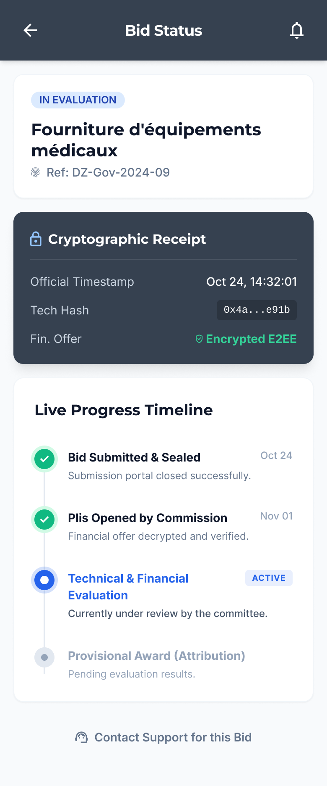
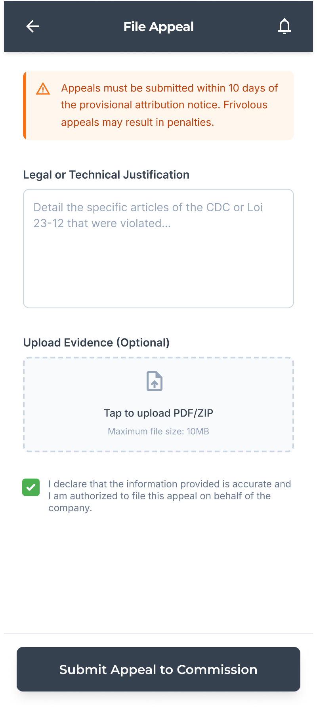
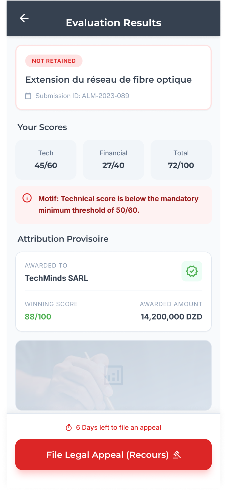

<div align="center">


# Al-Mizan Mobile (الـمـيـزان)
### Algerian Public Procurement & Tender Management Platform

[](https://kotlinlang.org/)
[](https://developer.android.com/)
[](https://developer.android.com/jetpack/compose)
[](https://gradle.org/)
[](#)

</div>

---

## 📌 About The Project

**Al-Mizan** (الـمـيـزان) is a modern, high-performance Android mobile application built for vendors, contractors, and public operators participating in Algerian public tenders (*Appels d'offres*). 

As a core frontend client within the **KLODIT Microservices Ecosystem**, Al-Mizan connects securely to central API Gateways (`api.klodit.app`) to streamline the entire procurement lifecycle—from tender discovery and multi-criteria filtering to end-to-end encrypted bid submissions and legal appeals (*Recours*).

---

## ✨ Key Features

### 🔒 1. Secure Authentication & Identity
- **JWT & Cookie Session Management**: Automatic access and refresh token handling with `ApiClient` cookie jars.
- **Security Safeguards**: Multi-factor OTP verification (`Verificationscreen`), account lock protection, and password reset flows.
- **End-to-End Encryption (E2EE)**: Sensitive bid payloads and financial figures are client-encrypted via [`E2EECryptoManager`](app/src/main/java/com/klodit/almizan/util/E2EECryptoManager.kt) prior to transmission.

### 🔍 2. Tender Discovery & Smart Filtering
- **Real-Time Catalog**: Explore active public tenders across Algerian ministries, wilayas, and business sectors.
- **Granular Filter Engine**: Search by sector, geographic location, submission deadline, estimated contract value, and tender status (`DetailedFilter`).
- **Comprehensive Tender Details**: View full specifications, eligibility requirements, and lot distributions.

### 🧙 3. Interactive 5-Step Bid Wizard (*Soumissions*)
A guided step-by-step submission wizard that ensures contractors complete all mandatory compliance steps without omission:
1. **Lot Selection**: Pick target lots in multi-lot tenders (`Step1LotSelection`).
2. **Technical Offer**: Upload technical proposals, qualifications, and administrative certificates (`Step2TechnicalOffer`).
3. **Financial Offer**: Input pricing models, itemized cost estimates, and unit breakdown (`Step3FinancialOffer`).
4. **Bank Guarantee (*Caution Bancaire*)**: Attach and verify required bank deposit guarantees (`Step4BankGuarantee`).
5. **Final Review & E-Submission**: Encrypted final review and submission signature (`Step5FinalReview`).

### ⚖️ 4. Legal Appeals (*Recours*) & Claim Tracking
- **File Appeals**: Submit legal claims directly against rejected bids or evaluation discrepancies (`FileAppealScreen`).
- **Real-Time Status Monitoring**: Track evaluation updates, jury feedback, and status decisions in real time (`EvaluationResultsScreen`, `BidStatusScreen`).

### 📊 5. Dashboard & Analytics
- **Contractor Dashboard**: Key metrics on active bids, winning rates, submitted offers, and pending actions (`Dashboardscreen`).
- **Operator Analytics**: Graphical trends and submission statistics (`StatisticsScreen`).

### 🌐 6. Multi-Language & Modern UI
- **Native Localization**: Full support for **Arabic (العربية)**, **French (Français)**, and **English (English)** with dynamic locale switching ([`Localehelper`](app/src/main/java/com/klodit/almizan/util/Localehelper.kt)).
- **Jetpack Compose Material 3**: Sleek dark/light UI, fluid micro-animations, custom vector icons, and responsive layouts.

---

## 📱 Screenshots & Visual Gallery

| Bid Status | Bid Submitted | My Submissions |
|:---:|:---:|:---:|
|  |  |  |

| File Appeal | Rejected Notice |
|:---:|:---:|
|  |  |

---

## 🛠 Tech Stack & Architecture

Al-Mizan is engineered using **Modern Android Development (MAD)** practices and **Clean Architecture**:

* **Language**: Kotlin 1.9+
* **UI Framework**: Android Jetpack Compose + Material 3
* **Navigation**: Compose Navigation (`androidx.navigation:navigation-compose`)
* **Architecture Pattern**: MVVM (Model-View-ViewModel) with StateFlow & Coroutines
* **Networking**: Retrofit 2 + OkHttp 3 + Gson Converter
* **Security & Crypto**: Custom AES/E2EE Cryptographic Manager (`E2EECryptoManager`), Secure Storage
* **Build System**: Gradle with Kotlin DSL (`build.gradle.kts`, `libs.versions.toml`)
* **Target SDK**: 36 | **Min SDK**: 24 | **Java Version**: 11

---

## 📂 Repository Structure

```gfm
al-mizan-mobile/
├── app/                                  # Android Application Module
│   ├── src/
│   │   ├── main/
│   │   │   ├── java/com/klodit/almizan/
│   │   │   │   ├── data/                 # API Services, Repositories & Token Storage
│   │   │   │   │   ├── api/              # Retrofit API Interfaces (Tender, Soumission, Recours, Profile)
│   │   │   │   │   ├── auth/             # Auth DTOs & Repository
│   │   │   │   │   └── remote/           # ApiClient OkHttp & Cookie Management
│   │   │   │   ├── model/                # Data Models (Tenders, Bids, Notifications, Dashboard)
│   │   │   │   ├── navigation/           # NavGraph & Sealed Destinations
│   │   │   │   ├── ui/                   # Jetpack Compose UI Screens & Components
│   │   │   │   │   ├── auth/             # Login, Verification, Lock, Reset Pass screens
│   │   │   │   │   ├── bidwizard/        # Submission Wizard Screens & Steps
│   │   │   │   │   ├── dashboard/        # Dashboard Views
│   │   │   │   │   ├── home/             # Home Screen & Search Filters
│   │   │   │   │   ├── tender/           # Tender List & Details
│   │   │   │   │   └── theme/            # Material 3 Color, Type & Theme Definitions
│   │   │   │   ├── util/                 # E2EECryptoManager, LocaleHelper, FileUtil
│   │   │   │   └── viewmodel/            # ViewModel Business Logic Layer
│   │   │   └── res/                      # Layout Resources, Strings (ar, en, fr), Drawables
│   └── build.gradle.kts                  # Module-level Gradle configuration
├── gradle/                               # Gradle Wrapper & Version Catalog
│   └── libs.versions.toml                # Dependency Version Catalog
├── Logo/                                 # Vector Brand Assets & App Logos
├── screenshots/                          # Screen Showcase Images
├── build.gradle.kts                      # Root Gradle configuration
├── settings.gradle.kts                   # Settings & Repository Configurations
└── README.md                             # Project Documentation
```

---

## 🚀 Setup & Installation

### Prerequisites
1. **Android Studio**: Ladybug / Koala or newer recommended.
2. **JDK**: Java Development Kit 11 or higher.
3. **Android SDK**: Target SDK 36 (Android 14/15 preview) with Min SDK 24.

### Building from Source

1. **Clone the Repository**:
   ```bash
   git clone https://github.com/SariYanouche/al-mizan-mobile.git
   cd al-mizan-mobile
   ```

2. **Open in Android Studio**:
   Open Android Studio, choose **Open**, and select the `al-mizan-mobile` root folder.

3. **Build & Run**:
   - Sync project with Gradle files.
   - Run on an Android Emulator or physical device:
     ```bash
     ./gradlew assembleDebug
     ```

---

## 👥 Authors & Acknowledgments

This mobile application was designed and developed as part of the **KLODIT** organization ecosystem:

* **SariYanouche** ([@SariYanouche](https://github.com/SariYanouche))
* **Yams4** ([ly_bahamid@esi.dz](mailto:ly_bahamid@esi.dz))

---

<div align="center">
  <sub>Built with ❤️ for the KLODIT Platform</sub>
</div>
